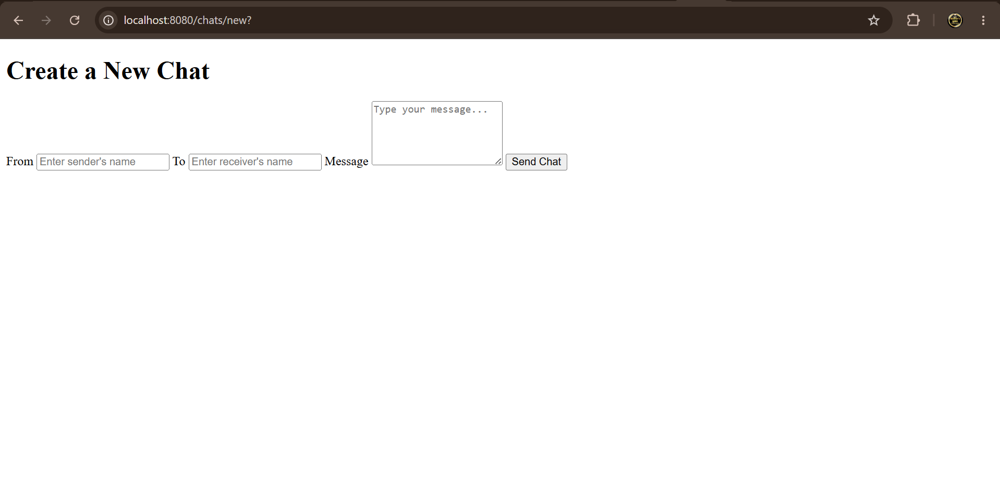
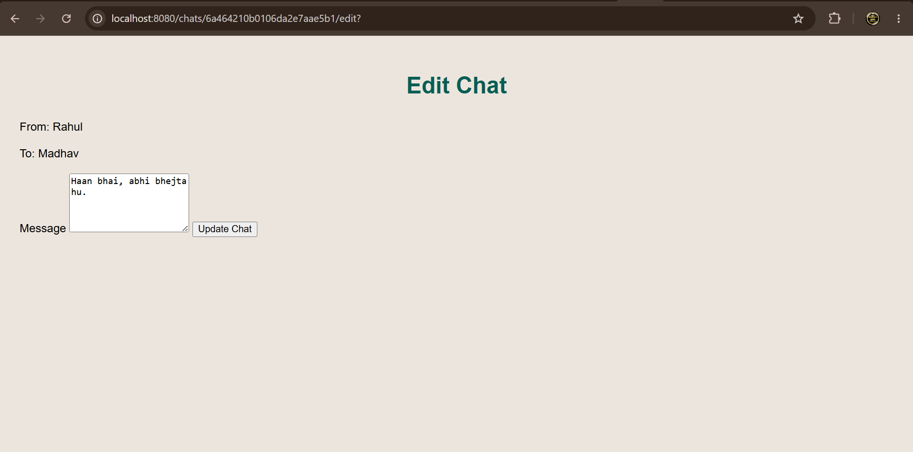

# MongoDB CRUD Chat

A simple CRUD-based chat application developed using **Node.js**, **Express.js**, **MongoDB**, and **EJS**. The application allows users to create, edit, update, and delete chat messages while demonstrating basic database operations and server-side rendering.

---

## Features

- Create new chat messages
- View all chats
- Edit existing chats
- Delete chats
- MongoDB database integration
- Server-side rendering using EJS
- Clean and responsive UI

---

## Tech Stack

- Node.js
- Express.js
- MongoDB
- Mongoose
- EJS
- HTML
- CSS

---
### Home Page


The homepage displays all chat messages stored in MongoDB. Users can quickly view conversations and perform CRUD operations using the Edit and Delete buttons.

---

### Add New Chat



This page allows users to create a new chat by entering the sender, receiver, and message. The submitted data is stored in the MongoDB database.

---

### Edit Chat



Users can update an existing chat message without affecting the sender or receiver details. The changes are saved instantly to MongoDB.
## Folder Structure

```
├── models/
├── routes/
├── public/
│   ├── css/
│   └── js/
├── views/
├── app.js
├── package.json
└── README.md
```

---

## Installation

Clone the repository

```bash
git clone https://github.com/your-username/mongodb-crud-chat.git
```

Go to the project directory

```bash
cd mongodb-crud-chat
```

Install dependencies

```bash
npm install
```

Start MongoDB locally.

Run the application

```bash
node app.js
```

or

```bash
nodemon app.js
```

Open your browser

```
http://localhost:8080
```

---

## CRUD Operations

| Operation | Route |
|-----------|-------|
| Create Chat | POST |
| Read Chats | GET |
| Update Chat | PATCH |
| Delete Chat | DELETE |

---

## Future Improvements

- User Authentication
- Real-time messaging using Socket.io
- User profiles
- Chat search functionality
- Image sharing
- Responsive mobile UI
- Cloud deployment

---

## Author

**Madhav Sahu**

GitHub: https://github.com/<your-github-username>

---

## License

This project is open-source and available under the MIT License.